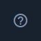

Directus
========

Directus --- это Headless CMS (система, которая отображает контент через RESTful API)
с открытым исходным кодом, который объединяет пользовательские базы данных SQL с динамическим API.

Логинация
---------

Главное условие для входа --- это наличие ссылки на ваш сервер со справочниками, логина и пароля.
Если каких-то данных не хватает, уточните их у вашего руководителя.

..  thumbnail:: images/directus-1-logination.png
    :align: center
    :alt: Directus
    :class: framed

Меню
----

Разделы меню включают в себя:

#.  |Content-Icon| --- раздел со всеми справочниками. Тут вы можете редактировать уже созданные справочники.
#.  |User-Directory-Icon| --- раздел с пользователями. Здесь создаются и редактируются пользователи Directus.

    ..  attention:: Раздел отвечает именно за пользователей Directus, а не пользовательского приложения.

#.  |File-Library-Icon| --- раздел с файловой системой. Если есть необходимость загрузить файл в базу данных, то можно это сделать здесь.
#.  |Insights-Icon| --- в этом разделе можно создавать дашборды, но мы для этого используем Grafana, поэтому раздел не задействован.
#.  |Documentation-Icon| --- это раздел с внутренней документацией Directus. В нём можно подробнее узнать о работе самого Directus.
#.  |Settings-Icon| --- это раздел с настройками. В нём можно:
    
    *   настраивать проект,
    *   создавать, удалять и настраивать справочники,
    *   создавать, удалять и настраивать роли,
    *   создавать, удалять и настраивать пресеты,
    *   работать с переводами на другие языки,
    *   работать с Webhook,
    *   сообщить о найденном баге,
    *   запросить новую фичу.

