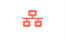
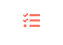

N8N
===

N8n (workflow tool с открытым исходным кодом) используется для реализации бизнес-процессов и
бизнес-правил высокого уровня, таких как массовое изменение объектов, отправка уведомлений, реагирование на события и тд. 

Сценарии в n8n можно редактировать прямо в браузере:
это повышает гибкость подстройки системы без необходимости выпускать новые версии конфигурации.
Бизнес-процессы в n8n реализуются как определенные сценарии, состоящие из узлов,
отвечающих за реакцию на триггер, получение, обработку или отправку данных.

Логинация
---------

Для входа вам потребуются данные для входа. Если у вас их нет, то обратитесь к вашему руководителю.

..  thumbnail:: images/n8n-1-logination.png
    :width: 50%
    :alt: N8N

Общий вид сервиса
-----------------

..  thumbnail:: images/n8n-2-overview.png
    :align: center
    :alt: N8N

Описание нужных для работы элементов
------------------------------------

#.  Элемент меню “Workflow” --- |Workflow-Icon|.
    При наведении на этот элемент появляется меню:

    ..  thumbnail:: images/n8n-3-workflow-menu.png
        :width: 50%
        :alt: N8N
        :class: framed

    Из основных для работы тут это “New” и “Open”. “New” открывает новый пустой workflow для скрипта,
    а “Open” – открывает меню со списком сохраненных скриптов, при нажатии на которые открывается соответствующий workflow.

#.  Элемент меню “Executions” --- |Executions-Icon|.
    При нажатии на этот элемент открывается список с результатами автоматического выполнения скриптов:

    ..  thumbnail:: images/n8n-4-executions-list.png
        :align: center
        :alt: N8N
        :class: framed

    Статус указывает на то выполнен скрипт удачно или с ошибкой. Так же нажав на кнопку |Folder-Icon| можно посмотреть выполнение скрипта:

    ..  thumbnail:: images/n8n-5-script.png
        :align: center
        :alt: N8N
        :class: framed

    В открытом execution видны какие ноды (каждый квадрат называется нодой и имеет свой функционал и параметры,
    стрелки – связи между нодами по которым передаются данные от ноды к ноде в соответствующем порядке) отработали (зеленая рамка),
    в какие скрипт не дошел (без цветной рамки) и какие не отработали из-за ошибки (красная рамка).
    Ошибку можно посмотреть дважды нажав на соответствующую ноду.

..  note:: В execution невозможно выполнение и изменение нод и всего скрипта, так как тут отображается только выполнение.

Начало работы
-------------

Для создания новой ноды необходимо нажать на кнопку |New-Nod-Icon| в правой стороне окна.
Откроется список выбора типа нод. Так как список возможных нод очень большой,
лучше искать нужную ноду через поиск вверху этого меню.

..  thumbnail:: images/n8n-6-nod-menu.png
    :width: 50%
    :alt: N8N
    :class: framed

После выбора нужной ноды, она автоматически откроется для настройки.
У каждого типа нод свои настройки, про которые можно почитать в официальной документации https://docs.n8n.io/.

После того как вы внесли нужны ноды и закончили работу необходимо нажать на кнопку Save:

..  thumbnail:: images/n8n-7-save.png
    :width: 40%
    :alt: N8N
    :class: framed

Так же в случае, если ваш скрипт должен выполнятся автоматически по тригеру
(для каждого из тригера заводится отдельная нода, но не более одной на скрипт),
то после сохранения необходимо перевести слайдер “Active” в активное состояние.

Для более удобной ориентации между своими workflow, в левом верхнем углу можно внести имя для скрипта.

..  note:: После ввода имени происходит автоматическое сохранение

..  thumbnail:: images/n8n-8-my-workflow-3.png
    :width: 40%
    :alt: N8N
    :class: framed

