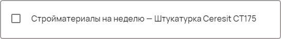
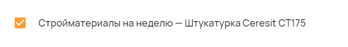

Единичный чекбокс
=================

С помощью компонента можно задавать закрытые вопросы. В форме будет выведен небольшой чекбокс и сам вопрос.

Как задать компонент формы?
---------------------------

.. code-block:: json
    
    "stock": {
                "type": "checkbox",
                "title": "Стройматериалы на неделю --- Штукатурка Ceresit CT175"
    }

#.  ``productivity`` --- это ``FIELDNAME``. Задётся пользователем и необходимо для объявления любого компонента.
#.  ``type`` --- тип элемента. Для единичного чекбокса — это всегда ``checkbox``.
#.  ``title`` --- название поля, отображаемое в форме. Формат: ``string``.

Пример
------

JSON-схема для компонента в конфигураторе:

.. code-block:: json
    
    "stock": {
                "type": "checkbox",
                "title": "Стройматериалы на неделю --- Штукатурка Ceresit CT175"
    }

Единичный чекбокс в пользовательском приложении:

Как сохраняются данные?
-----------------------

Данные сохраняются в ``FormInstances`` в конфигураторе.

Выбранные значения списка в пользовательском приложении:

После сохранения данные попадают в ``FromInstances`` в конфигураторе. Они сохраняются также в JSON формате:

.. code-block:: json

    {
      "stock": true
    }

Стоит обратить внимание, что в ``FromInstances`` идут значения из ``enum``, а не наименования из ``enumNames``.