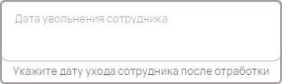
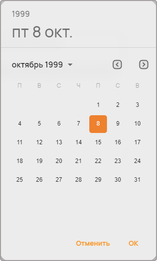
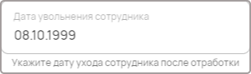

Дата
====

Компонент используется для ввода даты.

Как задать компонент формы?
---------------------------

..  code-block:: json

    "last-date": {
                    "type": "date",
                    "title": "Дата устранения замечания",
                    "helperText": "Укажите примерную дату устранения замечания"
    }

#.  ``last-date`` --- это ``FIELDNAME``. Задётся пользователем и необходимо для объявления любого компонента.
#.  ``type`` --- тип элемента. Для поля даты — это всегда ``date``.
#.  ``title`` --- название поля, отображаемое в форме. Формат: ``string``.
#.  ``helperText`` --- описание поля. Отображается как текст под полем ввода даты. Формат: ``string``.

Пример
------

JSON-схема для компонента в конфигураторе:

..  code-block:: json

    "fire-date": {
                    "type": "date",
                    "title": "Дата увольнения сотрудника",
                    "helperText": "Укажите дату ухода сотрудника после отработки"
    }

Как оно выглядит в пользовательском приложении:

Окно выбора даты:

Как сохраняются данные?
-----------------------

Данные сохраняются в ``FormInstances`` в конфигураторе.

Заполненное поле даты в пользовательском приложении:

После сохранения данные попадают в ``FromInstances`` в конфигураторе. Они сохраняются также в JSON формате:

..  code-block:: json

    {
      "fire-date": 939347333000
    }

Дата хранится в виде временной метки (timestamp).

..  note::
    Timestamp --- это последовательность символов или закодированной информации, показывающей, когда произошло определённое событие.
    Обычно показывает дату и время (иногда с точностью до долей секунд).
