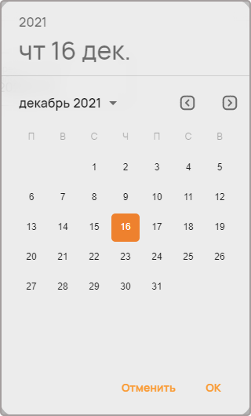
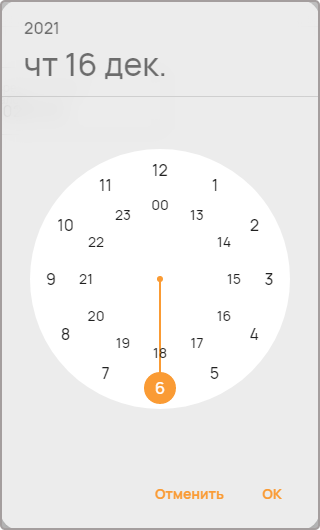
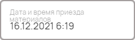

Дата и временя
==============

Компонент используется для ввода даты и времени.

Как задать компонент формы?
---------------------------

.. code-block:: json

    "arrive-date": {
                    "type": "datetime",
                    "title": "Дата и время начала смены сотрудника",
                    "helperText": "Укажите точное время прихода сотрудника на работу"
    }

#.  ``arrive-date`` --- это ``FIELDNAME``. Задётся пользователем и необходимо для объявления любого компонента.
#.  ``type`` --- тип элемента. Для поля даты и времени — это всегда ``datetime``.
#.  ``title`` --- название поля, отображаемое в форме. Формат: ``string``.
#.  ``helperText`` --- описание поля. Отображается как текст под полем ввода даты и времени. Формат: ``string``.

Пример
------

JSON-схема для компонента в конфигураторе:

.. code-block:: json

    "entry-date": {
                    "type": "datetime",
                    "title": "Дата и время приезда материалов"
    }

Как оно выглядит в пользовательском приложении:

Окно выбора даты:

Окно выбора времени следует сразу после выбора даты:

Как сохраняются данные?
-----------------------

Данные сохраняются в ``FormInstances`` в конфигураторе.

Заполненное поле даты и времени в пользовательском приложении:

После сохранения данные попадают в ``FromInstances`` в конфигураторе. Они сохраняются также в JSON формате:

.. code-block:: json

    {
       "entry-date": 1639624790000
    }

Дата и время хранятся в виде временной метки (timestamp).

.. note::
    Timestamp --- это последовательность символов или закодированной информации, показывающей, когда произошло определённое событие.
    Обычно показывает дату и время (иногда с точностью до долей секунд).
