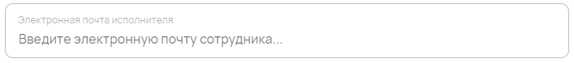
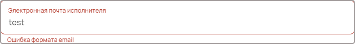

Email
=====

Используется для ввода электронной почты. Компонент использует систему верификации формата email.

Как задать компонент формы?
---------------------------

.. code-block:: json

    "email": {
                "type": "email",
                "title": "Электронная почта",
                "description": "Введите электронную почту ответственного лица..."
    }

#.  ``email`` --- это ``FIELDNAME``. Задётся пользователем и необходимо для объявления любого компонента.
#.  ``type`` --- тип элемента. Для электронной почты — это всегда ``email``.
#.  ``title`` --- название поля, отображаемое в форме. Формат: ``string``.
#.  ``description`` --- описание поля. Отображается как заглушка поля в форме. Формат: ``string``.

Пример
------

JSON-схема для компонента электронной почты в конфигураторе:

.. code-block:: json

    "executor-email": {
                        "type": "email",
                        "title": "Электронная почта исполнителя",
                        "description": "Введите электронную почту сотрудника..."
    }

Как оно выглядит в пользовательском приложении:

Реакция компонента на неверную форму email:

Как сохраняются данные?
-----------------------

Данные сохраняются в ``FormInstances`` в конфигураторе.

Заполненное поле электронной почты в пользовательском приложении:

После сохранения данные попадают в ``FromInstances`` в конфигураторе. Они сохраняются также в JSON формате:

.. code-block:: json

    {
      "executor-email": "test@plotpad.ru"    
    }
