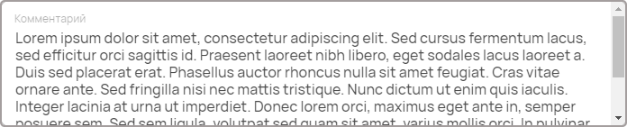

Многострочный текст
===================

Используется для ввода многострочных текстовых данных: описания, комментарии, заметки и прочее.

Как задать компонент формы?
---------------------------

.. code-block:: json

    "notes": {
                "type": "textarea",
                "title": "Заметки",
                "description": "Поле для заметок",
                "maxLength": 200,
                "minLength": 10
    }

#.  ``notes`` --- это ``FIELDNAME``. Задётся пользователем и необходимо для объявления любого компонента.
#.  ``type`` --- тип элемента. Для многострочного текста — это всегда ``textarea``. 
#.  ``title`` --- название поля, отображаемое в форме. Формат: ``string``.
#.  ``description`` --- описание поля. Отображается как заглушка поля в форме. Формат: ``string``.
#.  ``minLength`` --- минимальное количество символов в поле для того, чтобы заполненная форма считалась корректной. Формат: ``number``.
#.  ``maxLength`` --- максимальное количество символов в поле для того, чтобы заполненная форма считалась корректной. Формат: ``number``.

Пример
------

JSON-схема для компонента в конфигураторе:

.. code-block:: json

    "comment": {
                "type": "textarea",
                "title": "Комментарий",
                "description": "Введите комментарий...",
                "maxLength": 100
    }

Как оно выглядит в пользовательском приложении:

Как сохраняются данные?
-----------------------

Данные сохраняются в ``FormInstances`` в конфигураторе.

Заполненное многострочное текстовое поле в пользовательском приложении:

После сохранения данные попадают в ``FromInstances`` в конфигураторе. Они сохраняются также в JSON формате:

.. code-block:: json

    {
      "comment": "Lorem ipsum dolor sit amet, consectetur adipiscing elit. Sed cursus fermentum lacus, sed efficitur orci sagittis id. Praesent laoreet nibh libero, eget sodales lacus laoreet a. Duis sed placerat erat. Phasellus auctor rhoncus nulla sit amet feugiat. Cras vitae ornare ante. Sed fringilla nisi nec mattis tristique. Nunc dictum ut enim quis iaculis. Integer lacinia at urna ut imperdiet. Donec lorem orci, maximus eget ante in, semper posuere sem. Sed sem ligula, volutpat sed quam sit amet, varius mollis orci. In pulvinar accumsan ligula. Phasellus ornare imperdiet leo, eget laoreet ex accumsan et. Praesent ac odio sem. Praesent dapibus lobortis neque, nec malesuada est congue vestibulum."
    }