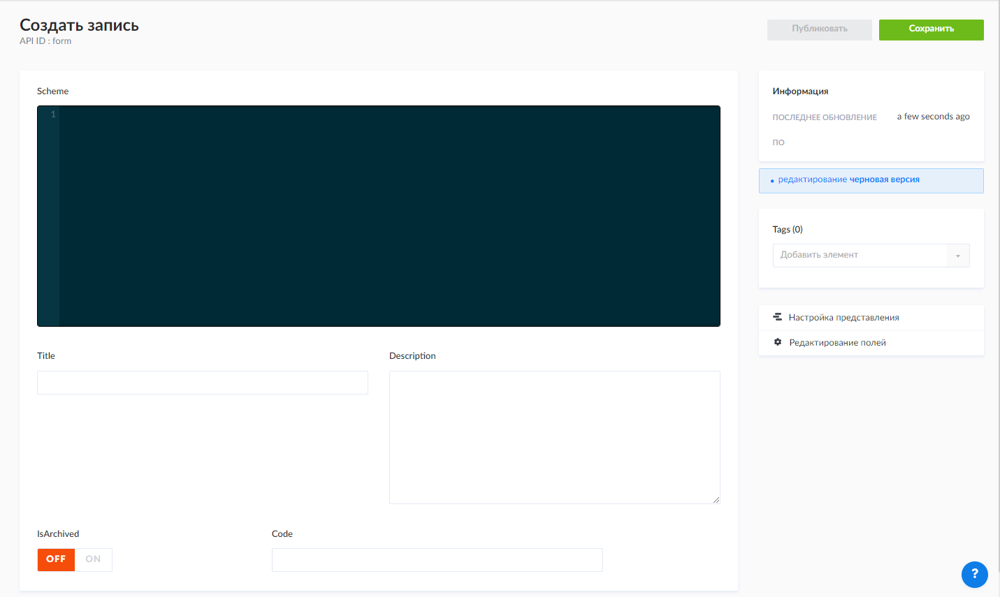
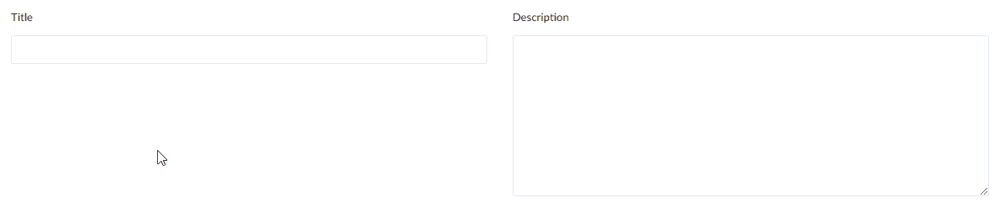
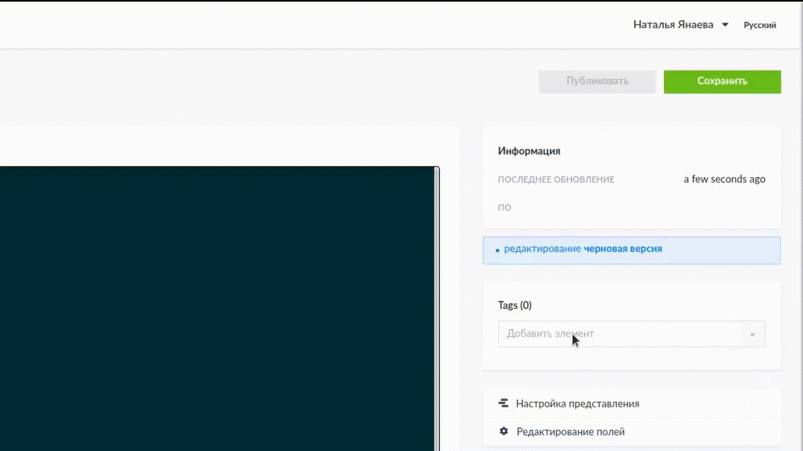

Работа с формой в конфигураторе
================================

Для создания формы в конфигураторе надо перейти на вкладку **Forms**:

..  image:: images/forms-1-strapi.gif
    :alt: Форма в конфигураторе
    :align: center

----

Чтобы создать форму, нажмите на кнопку |Add Form| в правом верхнем углу страницы.

----

После этого перед вами открывается окно создания формы:

----

**Scheme** --- это основное рабочее поле, в котором записывается JSON-схема.

..  image:: images/forms-4-json-field.gif
    :alt: Создание формы в конфигураторе
    :align: center

----

В поле **Title** записывается название формы, которое будет отображаться в конфигураторе и клиентском приложении.
В поле **Description** стоит записывать краткое описание формы, которое может пояснять её необходимость.

----

Для публикации формы в клиентском приложении, в поле **Tags** необходимо выбрать элемент ``customForm``.
После того, как все поля были заполнены, форму необходимо сохранить и опубликовать, нажав соответствующие кнопки.

----

Для последующего редактировании формы достаточно будет просто нажимать кнопку сохранить, чтобы изменения появились
в клиенте.