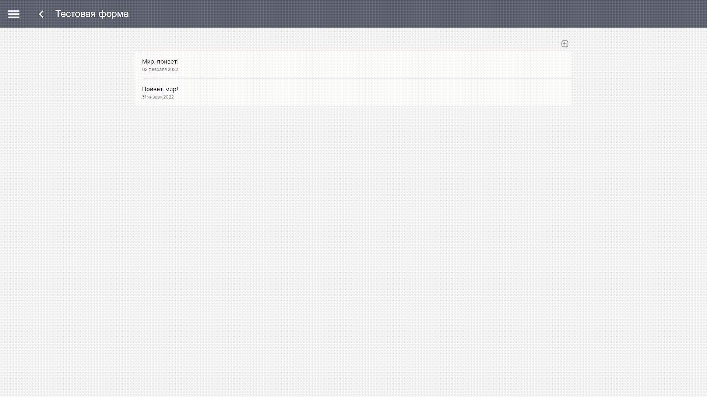
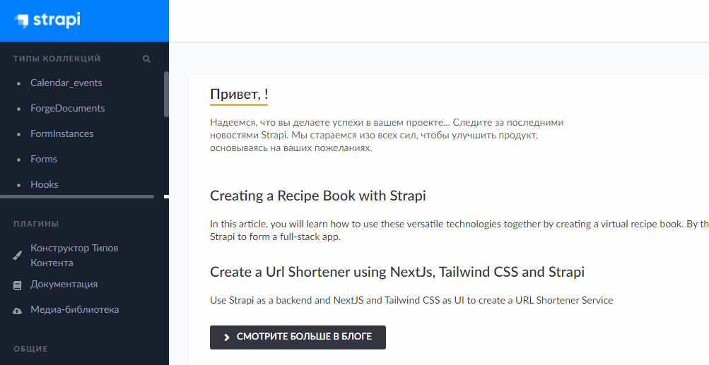

Экземпляр формы
===============

:Экземпляр формы:   это форма созданная из единого конфигурируемого шаблона. Заполняется пользователем клиентского приложения.

Экземпляр формы в клиентском приложении
---------------------------------------

После написания JSON-схемы в конфигураторе и публикации, в клиентском приложении у вас появляется сама форма.
Форма, написанная один раз, может переиспользоваться множество раз с разными входными данными.

То есть, когда в клиенте вы заходите на страницу созданной формы, там можно создавать множество **экземляров формы**.

..  image:: images/form-instances-1-client.gif
    :alt: Форма в конфигураторе
    :align: center

----

Заполнение экземпляра формы:

Экземпляр формы в конфигураторе
-------------------------------

Данные, которые заполняет пользователь в экземляре формы, сохраняются в конфигураторе в разделе ``FormInstances``.
Для удобства стоит использовать фильтрацию.
Самый простой способ использовать название, которое вы дали своему экземпляру.
Учтите, что по фильтру **равно** надо вводить точное название экземпляра вашей формы, учитывая регистр и пунктуационные знаки.

----

Сохранение происходит в JSON-формате по шаблону:

..  code-block:: json
    
    {
    "Наименование поля": "Данные поля"
    }
    
То есть заполненный пример из предыдущего пункта статьи сохранится так:

..  code-block:: json

     "Hello World!": {
         "dateField": 1643694572000,
         "textField": "Привет, мир!"
     }
