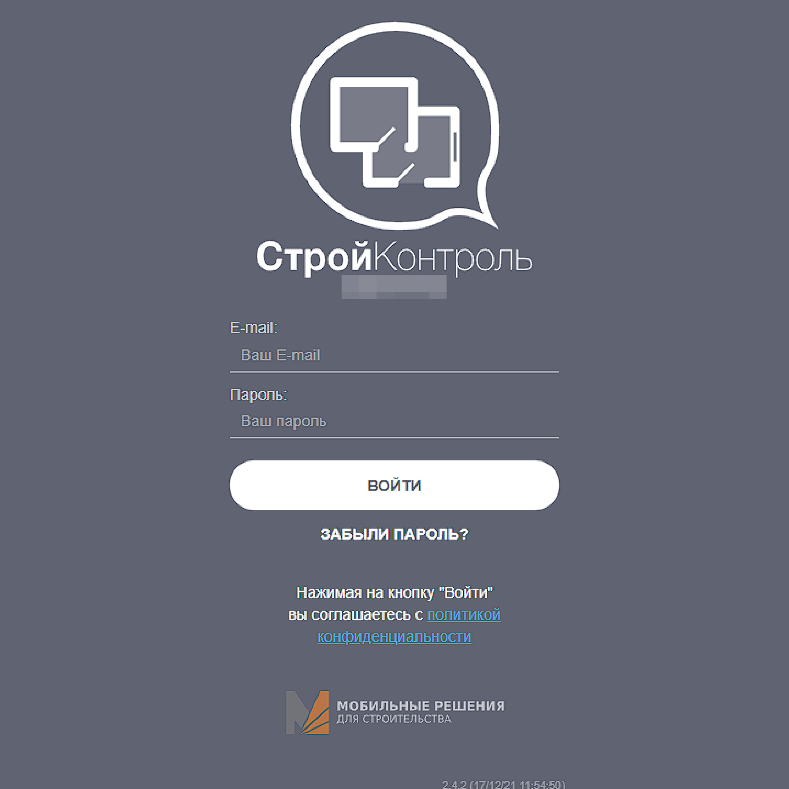

:orphan:

Логинация
=========

Перед началом работы вы должны убедиться, что у вас есть:

#.  Код вашей организации.
#.  Данные --- email и пароль --- созданного для вас пользователя в **Конструкторе** и в **Конфигураторе**.

Если чего-то из этого вам не хватает, обратитесь к ответственному лицу в вашей компании.

Конструктор
-----------

Чтобы попасть в Конструктор вашей организации перейдите по ссылке::

    [код_организации].plotpad.com

#.  Введите код вашей организации:

.. image:: images/app-logination-1.png
    :width: 70%
    :alt: Окно логинации в Конструкторе: ввод кода организации
    :align: center

----

2.  Используйте email и пароль для входа:

----

3.  Если возникают какие-то трудности со входом, то обратитесь в нашу службу поддержки через ответственное лицо вашей организации.