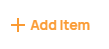
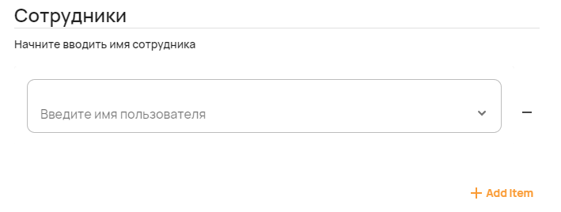
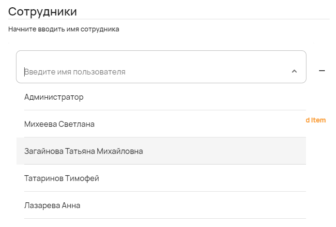
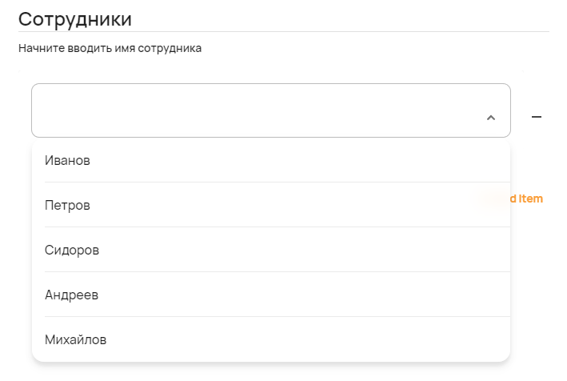
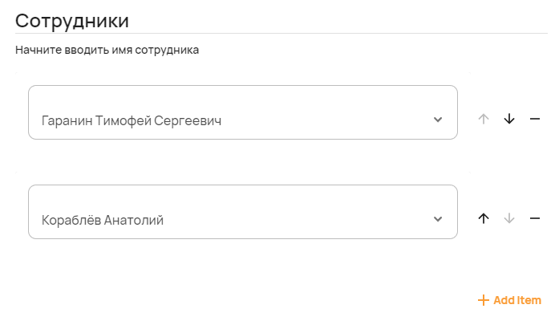

Список с выбором из множества значений
======================================

С помощью компонента можно создавать список, который наполняется значениями либо из справочников, либо вручную.
С этим компонентом можно использовать даже компонент ``user``, который даёт возможность выбирать пользователей из базы данных "СтройКонтроля".

Как задать компонент формы?
---------------------------

Список с выбором из множества значений совместно с компонентом выбора пользователей из базы данных "СтройКонтроля"
задаётся следующей JSON-схемой:

.. code-block:: json
    
    "UserArray": {
            "title": "Сотрудники",
            "description": "Начните вводить имя сотрудника",
            "type": "array",
            "minItems": 2,
            "maxItems": 4,
            "items": {
                "type": "user"
            }
    }

JSON-схема для списка с выбором из множества значений с ручным вводом данных:

.. code-block:: json

    "HandArray": {
            "title": "Сотрудники",
            "description": "Начните вводить имя сотрудника",
            "type": "array",
            "minItems": 2,
            "maxItems": 4,
            "items": {
                "enum": [0, 1, 2, 3, 4],
                "enumNames": ["Иванов", "Петров", "Сидоров", "Андреев", "Михайлов"]
            }
    }

#.  ``UserArray`` и ``HandArray`` --- это ``FIELDNAME``. Задётся пользователем и необходимо для объявления любого компонента.
#.  ``title`` --- заголовок компонента, отображамый в форме. Формат: ``string``.
#.  ``description`` --- описание поля. Отображается под заголовком. Формат: ``string``.
#.  ``type`` --- тип элемента. Для списка с выбором из множества значений — это всегда ``array``.
#.  ``minItems`` --- минимальное количество выбранных элементов для того, чтобы заполненная форма считалась корректной. Формат: ``number``.
#.  ``maxItems`` --- максимальное количество выбранных элементов для того, чтобы заполненная форма считалась корректной. Формат: ``number``.
#.  ``items`` --- с помощью атрибута задаётся список значений, в котором прописываются следующие данные:
    
    #.  ``enum`` --- числовой список доступных значений.
        Если значений больше одного, они вписываются в квадратных скобках --- ``[]`` Формат: ``number``.
    #.  ``enumNames`` --- список отображающихся наименований для значений из поля ``enum``.
        Если значений больше одного, они вписываются в квадратных скобках --- ``[]`` Формат: ``string``.
    #.  ``type`` --- этот артрибут и верхние --- взаимоисключащие.
        Он используется только вместе с компонентом ``user`` и нужен для создания списков с пользователями из базы данных "СтройКонтроля".

Компонент изначально отображается в форме только с заголовком и описанием. Нажатием на кнопку |Add Item| можно добавить новый элемент в список.

Пример
------

JSON-схема для компонента с выбором пользователей из "СтройКонтроля" в конфигураторе:

.. code-block:: json
    
    "UserArray": {
            "title": "Сотрудники",
            "description": "Начните вводить имя сотрудника",
            "type": "array",
            "minItems": 2,
            "maxItems": 4,
            "items": {
                "type": "user"
            }
    }

Список с выбором пользователей из базы данных "СтройКонтроля" в пользовательском приложении:

JSON-схема для компонента с выбором пользователей заданных вручную в конфигураторе:

.. code-block:: json
    
    "HandArray": {
            "title": "Сотрудники",
            "description": "Начните вводить имя сотрудника",
            "type": "array",
            "minItems": 2,
            "maxItems": 4,
            "items": {
                "enum": [0, 1, 2, 3, 4],
                "enumNames": ["Иванов", "Петров", "Сидоров", "Андреев", "Михайлов"]
            }
    }

Список с выбором пользователей заданных вручную в пользовательском приложении:

Как сохраняются данные?
-----------------------

Данные сохраняются в ``FormInstances`` в конфигураторе.

Выбранные значения списка в пользовательском приложении:

С компонентом ``user``:

С ручным вводом:

.. image:: images/array-screen-5.png
    :alt: Пример компонента 
    :align: center

После сохранения данные попадают в ``FromInstances`` в конфигураторе. Они сохраняются также в JSON формате:

С компонентом ``user``:

.. code-block:: json

    "UserArray": [
            "60febbbc04d27d7b83d93c43",
            "5fdb50697ce63c231e6f8052"
    ]

При использовании компонента ``user``, в ``FormInstances`` попадают идентификаторы выбранных пользователей из базы данных "СтройКонтроля".

С ручным вводом:

.. code-block:: json

    "HandArray": [
            3,
            1
    ]

Стоит обратить внимание, что в ``FromInstances`` идут значения из ``enum``, а не наименования из ``enumNames``.