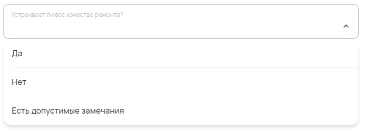
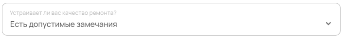

Пункт чеклиста
==============

С помощью компонента можно создавать большие чеклисты с вопросами и тремя возможными ответами --- `Принято, Не принято, Пропустить`.

Как задать компонент формы?
---------------------------

.. code-block:: json
    
    "questionOne": {
                    "type": "checklistItem",
                    "title": "Наличие штукатурки на стенах и ее качество",
                    "enum": ["accept", "decline", "skip"],
                    "enumNames": ["Принято", "Не принято", "Пропустить"]
    }

#.  ``questionOne`` --- это ``FIELDNAME``. Задётся пользователем и необходимо для объявления любого компонента.
#.  ``type`` --- тип элемента. Для пункта чеклиста — это всегда ``checklistItem``.
#.  ``title`` --- название поля, отображаемое в форме. Формат: ``string``.
#.  ``enum`` --- текстовый список доступных значений.
    Так как значений больше одного, они вписываются в квадратных скобках --- ``[]`` Формат: ``string``.
#.  ``enumNames`` --- список отображающихся наименований для значений из поля ``enum``. Он может отличаться от показанного в примере выше.
    Так как значений больше одного, они вписываются в квадратных скобках --- ``[]`` Формат: ``string``.

Пример
------

JSON-схема для компонента в конфигураторе:

.. code-block:: json
    
    "quality-check": {
                    "type": "checklistItem",
                    "title": "Устраивает ли вас качество ремонта?",
                    "enum": ["accept", "decline", "skip"],
                    "enumNames": ["Да", "Нет", "Есть допустимые замечания"]
    }

Развёрнутый пункт чеклиста в пользовательском приложении:

Как сохраняются данные?
-----------------------

Данные сохраняются в ``FormInstances`` в конфигураторе.

Выбранное значение списка в пользовательском приложении:

После сохранения данные попадают в ``FromInstances`` в конфигураторе. Они сохраняются также в JSON формате:

.. code-block:: json

    {
        "quality-check": "skip"
    }

Стоит обратить внимание, что в ``FromInstances`` идут значения из ``enum``, а не наименования из ``enumNames``.