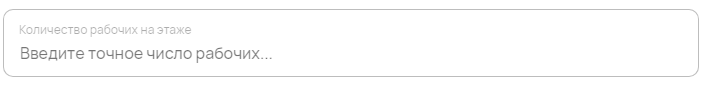
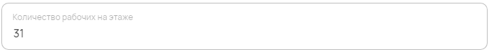

Числовые значения
=================

Компонент используется для ввода числовых значений.

Как задать компонент формы?
---------------------------

.. code-block:: json

    "workers-amount": {
                    "type": "number",
                    "title": "Количество рабочих на этаже",
                    "description": "Введите точное число рабочих..."
    }

#.  ``workers-amount`` --- это ``FIELDNAME``. Задётся пользователем и необходимо для объявления любого компонента.
#.  ``type`` --- тип элемента. Для числового поля — это всегда ``number``.
#.  ``title`` --- название поля, отображаемое в форме. Формат: ``string``.
#.  ``description`` --- описание поля. Отображается как заглушка поля в форме. Формат: ``string``.

Пример
------

JSON-схема для компонента в конфигураторе:

.. code-block:: json

    "workers-amount": {
                    "type": "number",
                    "title": "Количество рабочих на этаже",
                    "description": "Введите точное число рабочих..."
    }

Как оно выглядит в пользовательском приложении:

Как сохраняются данные?
-----------------------

Данные сохраняются в ``FormInstances`` в конфигураторе.

Заполненное числовое поле в пользовательском приложении:

После сохранения данные попадают в ``FromInstances`` в конфигураторе. Они сохраняются также в JSON формате:

.. code-block:: json

    {
       "workers-amount": 31
    }