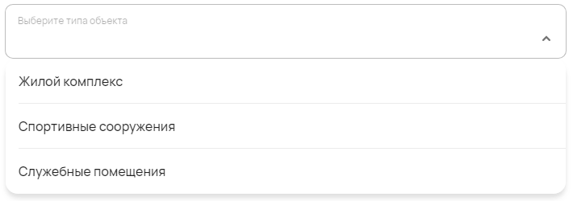
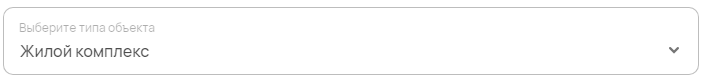

Ниспадающий список
==================

С помощью компонента можно создавать ниспадающие списки с ручным вводом значений.

Как задать компонент формы?
---------------------------

.. code-block:: json

    "objectType": {
                    "type": "select",
                    "title": "Выберите типа объекта",
                    "enum": [ "Жилой комплекс", "Спортивные сооружения", "Служебные помещения" ]
    }

#.  ``workers-amount`` --- это ``FIELDNAME``. Задётся пользователем и необходимо для объявления любого компонента.
#.  ``type`` --- тип элемента. Для ниспадающего списка — это всегда ``select``.
#.  ``title`` --- название поля, отображаемое в форме. Формат: ``string``.
#.  ``enum`` --- список доступных значений. Если значений больше одного, они вписываются в квадратных скобках --- ``[]`` Формат: ``string``.

Пример
------

JSON-схема для компонента в конфигураторе:

.. code-block:: json

    "objectType": {
                    "type": "select",
                    "title": "Выберите типа объекта",
                    "enum": [ "Жилой комплекс", "Спортивные сооружения", "Служебные помещения" ]
    }

Раскрытый список в пользовательском приложении:

Как сохраняются данные?
-----------------------

Данные сохраняются в ``FormInstances`` в конфигураторе.

Выбранное значение списка в пользовательском приложении:

После сохранения данные попадают в ``FromInstances`` в конфигураторе. Они сохраняются также в JSON формате:

.. code-block:: json

    {
        "objectType": "Жилой комплекс"
    }