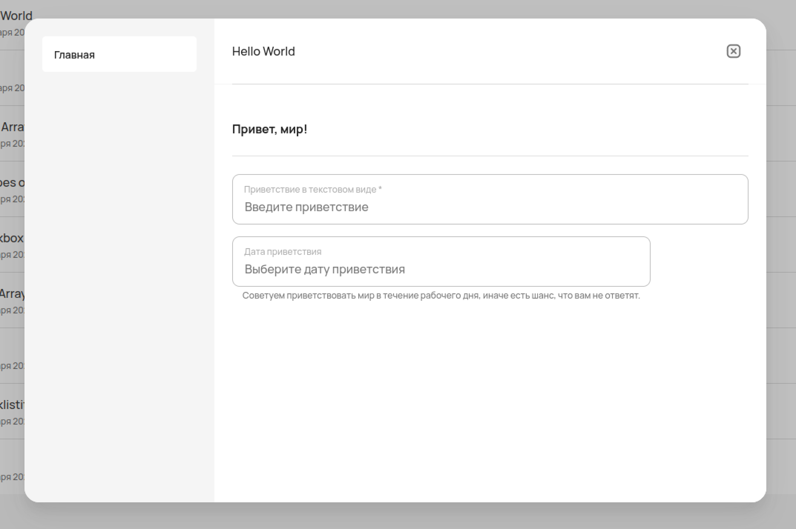

JSON-схема формы
================

Для создания форм и работы с остальными элементами системы вы знать и понимать **JSON**.

..  note:: JSON — текстовый формат обмена данными, основанный на JavaScript.
            Как и многие другие текстовые форматы, JSON легко читается людьми.

Шаблон JSON-схемы
-----------------

Ниже представлен основной шаблон JSON-схемы для форм со всеми присущими атрибутами.
Порядок атрибутов может быть любым.

..  code-block:: json
    
    {
        "id": "string (uuid?)",
        "title": "string",
        "required": "[ FIELDNAMES ]",
        "order": "[ FIELDNAMES ]",
        "dependencies": {
            "FIELDNAME_0": "[OTHER_FIELDNAMES]"
            }
        "properties": {
            "FIELDNAME": { "..."
                },
            }
        }
    }

``id`` --- поле, необходимое для идентификации схемы формы.

``title`` --- заголовок формы.

``required`` --- список полей, обязательных к заполнению

``order`` --- порядок следования полей в форме.
Можно указывать не все поля, в таком случае оставшиеся могут отобразиться в случайном порядке.

``dependencies`` --- список полей, зависящих друг от друга.
Если заполнено поле ``FIELDNAME_0``, то поля ``OTHER_FIELDNAMES`` тоже должны быть заполнены.

``properties`` --- список полей формы:

``FIELDNAME`` --- название поля, которое задается пользователем.

Основным атрибутом формы является ``properties`` и всё, что внутри него находится.
Все остальные атрибуты можно не добавлять, если такой необходимости нет.

Но форма не будет работать, если не добавить в ``properties`` хотя бы один компонент формы.
Подробнее о компонентах в разделе :doc:`/constructor/components`.

Пример формы
------------

Эта форма начинается с атрибутов, в которых:

*   задаётся название --- ``title``,
*   порядок отображения компонентов --- ``order``,
*   список обязательных компонентов --- ``required``.

..  literalinclude:: _includes/hello-world-form.json
    :language: json
    :lines: 2-8
    :dedent: 4

Далее в ``properties`` прописываются компоненты с необходимыми атрибутами:

..  literalinclude:: _includes/hello-world-form.json
    :language: json
    :lines: 10-36
    :dedent: 4

В клиентском приложении эта форма будет выглядеть следующим образом:

----

Подробнее о компонентах, которые использовались в этой форме:

#.  :doc:`/constructor/components/object`
#.  :doc:`/constructor/components/text`
#.  :doc:`/constructor/components/date`