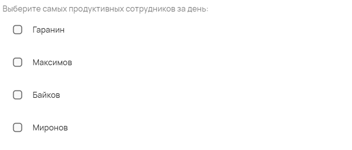
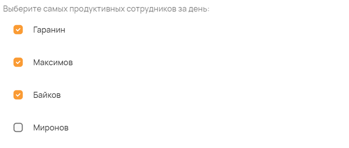

Список с выбором из множества значений
======================================

С помощью компонента можно создавать список, который наполняется значениями либо из справочников, либо вручную.
С этим компонентом можно использовать даже компонент ``user``, который даёт возможность выбирать пользователей из базы данных "СтройКонтроля".

Как задать компонент формы?
---------------------------

.. code-block:: json
    
    "selectUserArray": {
                        "type": "array",
                        "title": "Список пользователей",
                        "items": {
                            "type": "user"
                        }
                    }
                

#.  ``selectUserArray`` --- это ``FIELDNAME``. Задётся пользователем и необходимо для объявления любого компонента.
#.  ``type`` --- тип элемента. Для списка с множественным выбором — это всегда ``checkboxes``.
#.  ``minItems`` --- минимальное количество выбранных элементов для того, чтобы заполненная форма считалась корректной. Формат: ``number``.
#.  ``maxItems`` --- максимальное количество выбранных элементов для того, чтобы заполненная форма считалась корректной. Формат: ``number``.
#.  ``title`` --- название поля, отображаемое в форме. Формат: ``string``.
#.  ``items`` --- с помощью атрибута задаётся список значений, в котором прописываются следующие данные:
    
    #.  ``enum`` --- числовой список доступных значений.
        Если значений больше одного, они вписываются в квадратных скобках --- ``[]`` Формат: ``number``.
    #.  ``enumNames`` --- список отображающихся наименований для значений из поля ``enum``.
        Если значений больше одного, они вписываются в квадратных скобках --- ``[]`` Формат: ``string``.

Пример
------

JSON-схема для компонента в конфигураторе:

.. code-block:: json
    
    "productivity": {
        "type": "checkboxes",
        "minItems": 1,
        "maxItems": 3,
        "title": "Выберите самых продуктивных сотрудников за день:",
        "items": {
            "enum": [0, 1, 2, 3],
            "enumNames": ["Гаранин", "Максимов", "Байков", "Миронов"]
        }
    }

Список с множественным выбором в пользовательском приложении:

Как сохраняются данные?
-----------------------

Данные сохраняются в ``FormInstances`` в конфигураторе.

Выбранные значения списка в пользовательском приложении:

После сохранения данные попадают в ``FromInstances`` в конфигураторе. Они сохраняются также в JSON формате:

.. code-block:: json

    {
        "productivity": [ "0", "1", "2" ]
    }

Стоит обратить внимание, что в ``FromInstances`` идут значения из ``enum``, а не наименования из ``enumNames``.