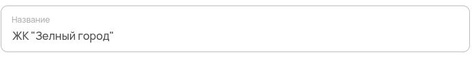

Многострочный текст
===================

Используется для ввода однострочных текстовых данных: названий и наименований.

Как задать компонент формы?
---------------------------

.. code-block:: json

    "name": {
            "title": "Название объекта",
            "description": "Введите название ЖК",
            "type": "text",
            "minLength": 3,
            "maxLength": 15
    }

#.  ``name`` --- это ``FIELDNAME``. Задётся пользователем и необходимо для объявления любого компонента.
#.  ``title`` --- название поля, отображаемое в форме. Формат: ``string``.
#.  ``description`` --- описание поля. Отображается как заглушка поля в форме. Формат: ``string``.
#.  ``type`` --- тип элемента. Для простого текстового элемента — это всегда ``text``. 
#.  ``minLength`` --- минимальное количество символов в поле для того, чтобы заполненная форма считалась корректной. Формат: ``number``.
#.  ``maxLength`` --- максимальное количество символов в поле для того, чтобы заполненная форма считалась корректной. Формат: ``number``.

Пример
------

JSON-схема для простого текстового поля в конфигураторе:

.. code-block:: json

    "location": {
                "type": "text",
                "title": "Местоположение",
                "description": "Укажите оси отметки"
    }

Как оно выглядит в Конструкторе:

.. image:: images/text-screen-1.png
    :alt: Пример текстового компонента
    :align: center

Как сохраняются данные?
-----------------------

Данные сохраняются в **FormInstances** в конфигураторе.

Заполненное текстовое поле в Конструкторе:

После сохранения данные попадают в FromInstances в конфигураторе. Они сохраняются также в JSON формате:

.. code-block:: json

    {
      "name": "ЖК \"Зелёный город\"",
    }