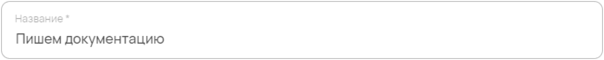
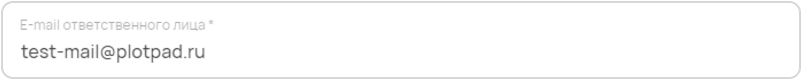
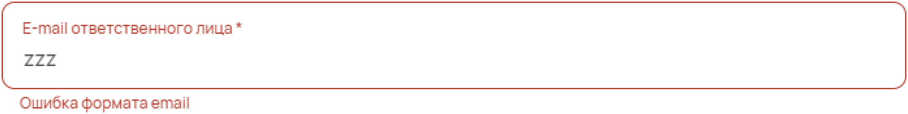
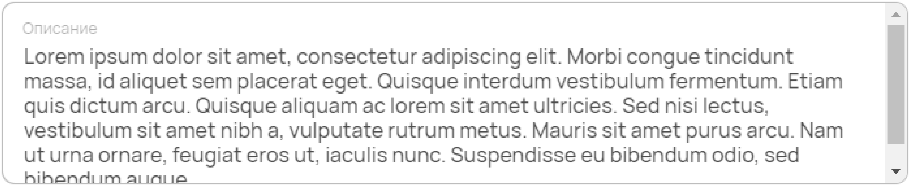
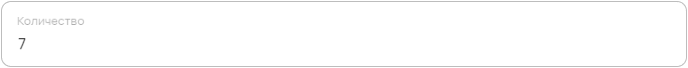
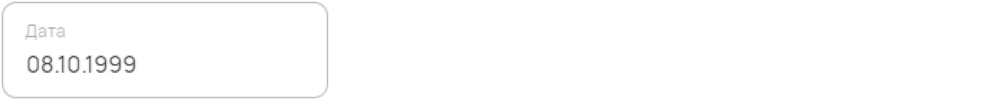

Текстовые элементы
==================

Простое текстовое поле
""""""""""""""""""""""

``text`` --- текстовое поле.

.. code-block:: json

    "name": {
            "title": "Название",
            "description": "Название объекта",
            "type": "text",
            "minLength": 3
    }

----

Текстовое поле в Конструкторе

Поле для ввода email
""""""""""""""""""""

``email`` --- поле почты. Используется с валидацией формата email.

.. code-block:: json

    "email": {
        "title": "E-mail ответственного лица",
        "type": "email",
    }

----

Email в Конструкторе

----

Неправильный ввод email в Конструкторе

Ввод многострочного текста
""""""""""""""""""""""""""

``textarea`` --- ввод многострочного текста.

.. code-block:: json

    "description": {
        "title": "Описание",
        "description": "Краткое или не очень описание",
        "type": "textarea",
    }

----

Многострочный текст в Конструкторе

Ввод числового значения
"""""""""""""""""""""""

``number`` --- числовое поле.

.. code-block:: json

    "amount": {
        "title": "Количество",
        "description": "Количество",
        "type": "number",
    }

----

Числовое значение в Конструкторе

Ввод даты
"""""""""

``date`` --- поле даты.

.. code-block:: json

    "date": {
        "title": "Дата",
        "description": "Дата начала",
        "type": "date",
    }

----

Дата в Конструкторе

Ввод даты и времени
"""""""""""""""""""

``datetime`` --- поле даты и времени.

.. code-block:: json

    "dateTime": {
        "title": "Дата и время",
        "description": "Дата и время начала",
        "type": "datetime",
    }

----

Время и дата в Конструкторе

