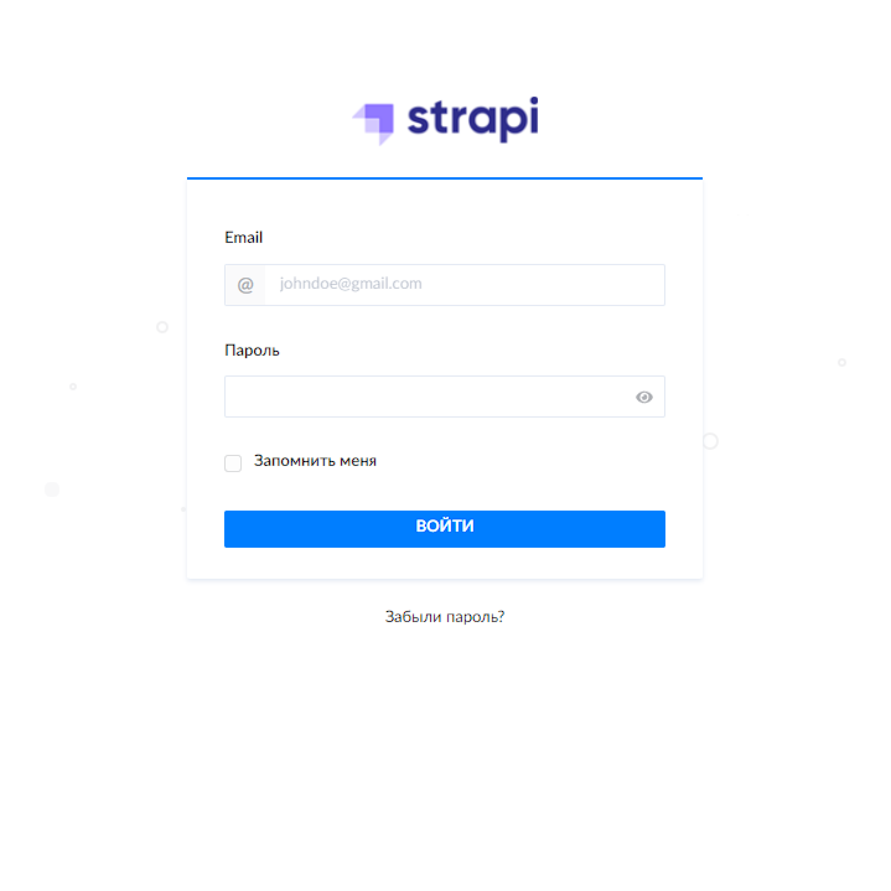
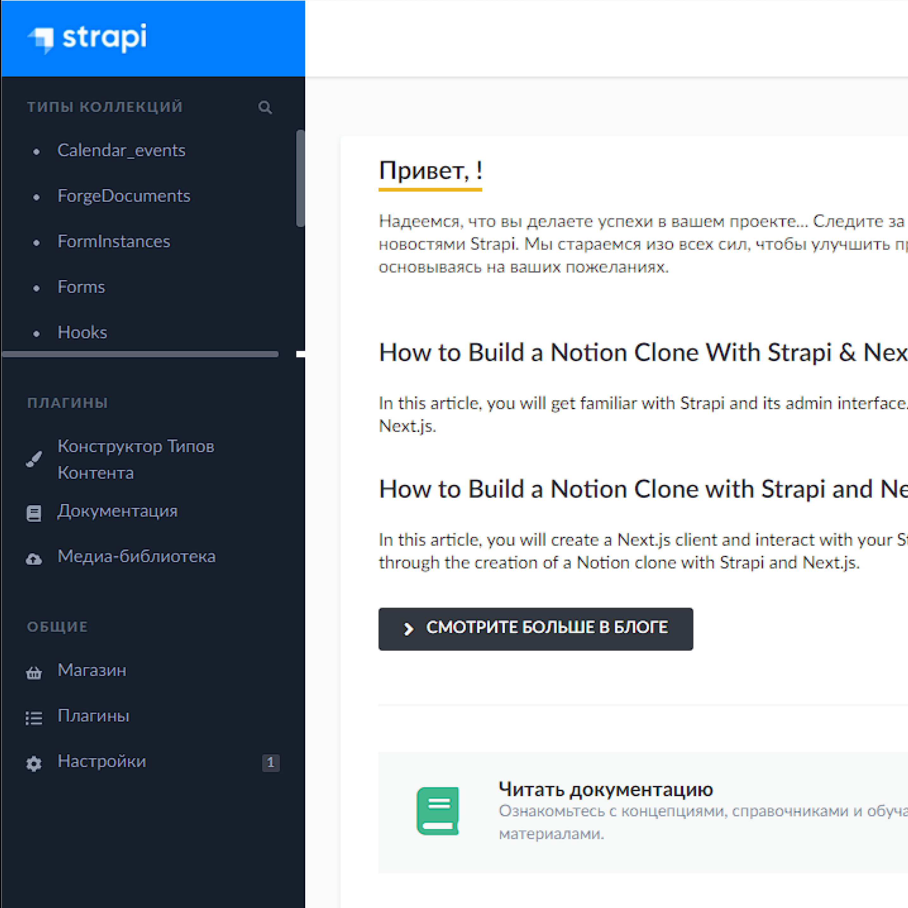

Как начать работу?
==================

Перед началом работы вы должны убедиться, что у вас есть:

#.  Код вашей организации.
#.  Данные --- email и пароль --- созданного для вас пользователя в **Конструкторе** и в **Конфигураторе**.

Если чего-то из этого вам не хватает, обратитесь к ответственному лицу в вашей компании.

Конструктор
-----------

Чтобы попасть в Конструктор вашей организации перейдите по ссылке::

    [код_организации].ССЫЛКА.ru

#.  Введите код вашей организации:

----

2.  Используйте email и пароль для входа:

.. image:: images/app-logination-2.png
    :width: 70%
    :alt: Окно логинации в Конструкторе: ввод email и пароля
    :align: center

----

3.  Если возникают какие-то трудности со входом, то обратитесь в нашу службу поддержки через ответственное лицо вашей организации.

Конфигуратор
------------

Вся работа с настройкой Конструктора происходит в **Конфигураторе**.

Чтобы попасть в конфигуратор вашей организации перейдите по ссылке::

    [код_организации].mrsdev.ru/api/admin

Для входа вам потребуются отдельные данные.
Они могут быть идентичными с данными для Конструктора, но это скорее совпадение, а не правило.

#.  Используйте email и пароль от конфигуратора для входа:

----

2.  На левой панели можно найти все элементы системы, которые есть в Конструкторе.

----

3. Подробнее о работе с элементами системы читайте в разделе :doc:`/constructor/elements-of-system`.